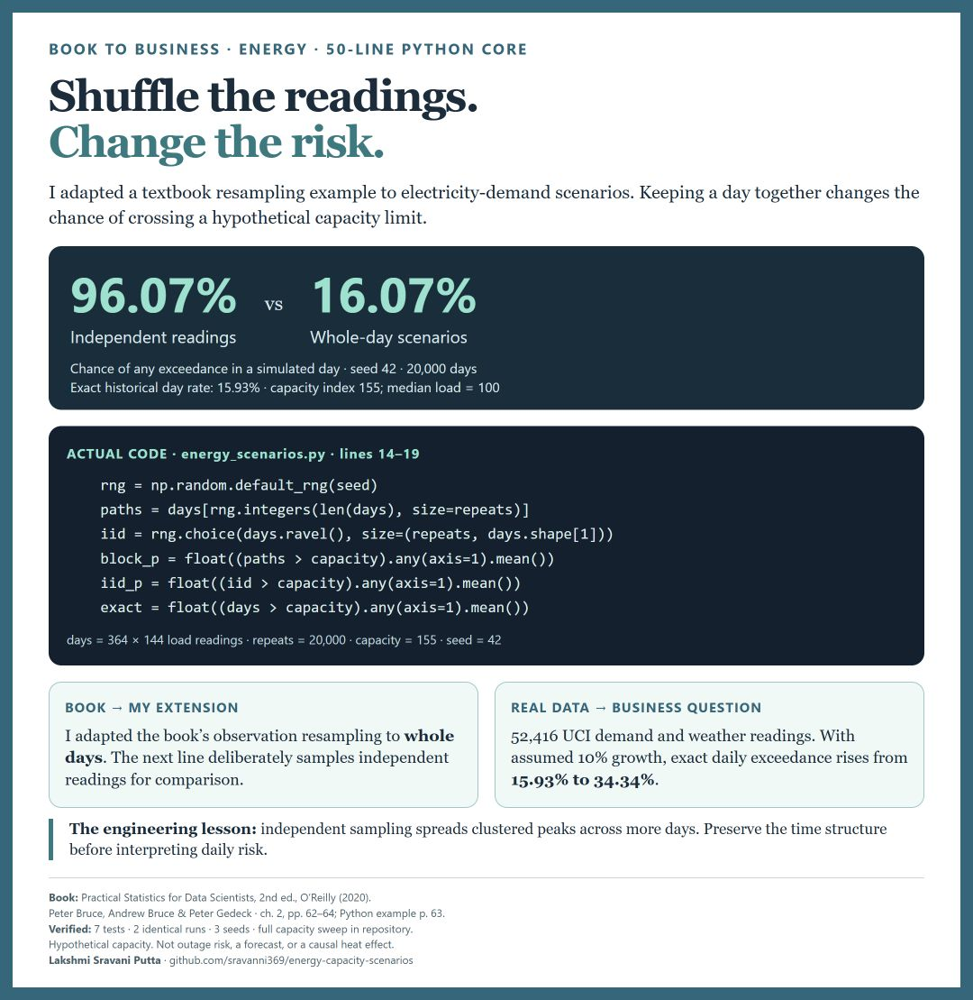
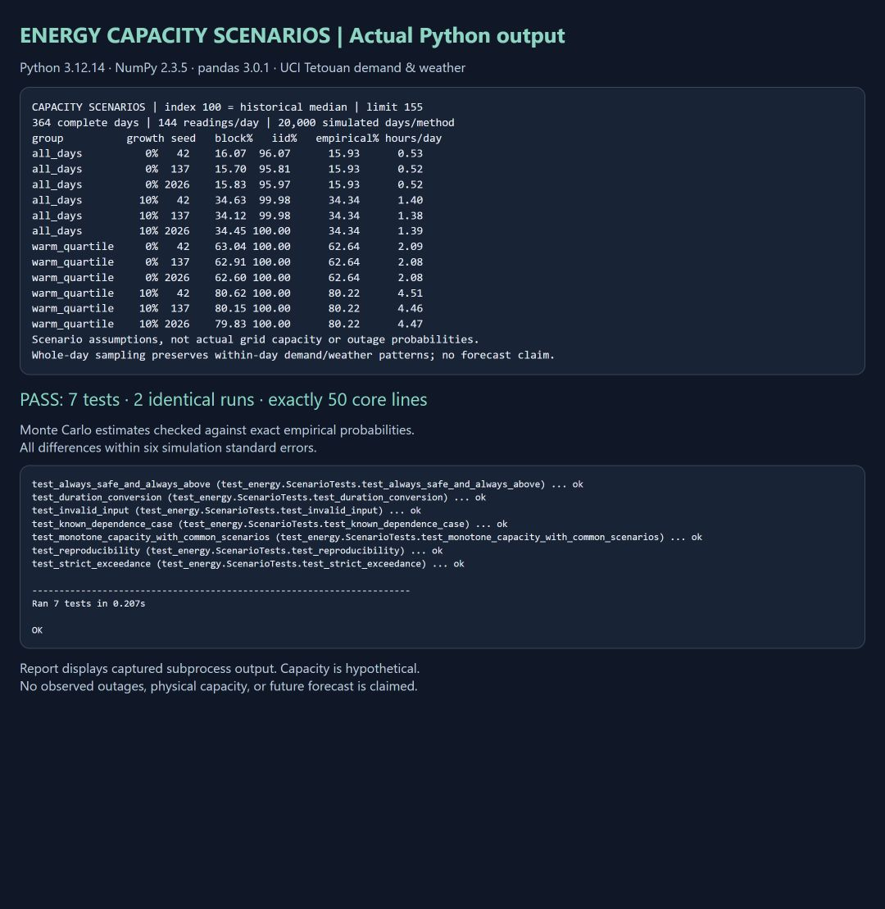

# Energy capacity scenarios: preserve the day before estimating the risk

**Independent 10-minute samples gave a 96.07% chance of a daily capacity exceedance. Sampling complete historical days gave 16.07%. The exact historical day rate was 15.93%.** These results use seed 42 and a hypothetical capacity index of 155, where 100 is the median aggregate load.

This 50-line Python core adapts textbook resampling to an energy planning problem: **how often would demand cross a stated capacity limit under historical demand patterns and an assumed growth scenario?** It is a retrospective scenario simulator, not an operational forecast or evidence of actual outages.



## Source book and what changed

Peter Bruce, Andrew Bruce and Peter Gedeck, *Practical Statistics for Data Scientists: 50+ Essential Concepts Using R and Python*, second edition, O'Reilly, 2020, chapter 2, **The Bootstrap**, printed pages 62–64. The Python resampling example is on **printed page 63 / PDF page 81** of the supplied copy. [Authors' repository](https://github.com/gedeck/practical-statistics-for-data-scientists).

The book resamples loan-income observations and calculates medians. This is an independently written adaptation of that sampling-with-replacement pattern, using seeded NumPy instead of scikit-learn. Its extensions are complete-day sampling, a daily exceedance event, weather-conditioned pools, demand-growth stress and comparison against exact empirical probabilities. It is **not** the book's Monte Carlo reinforcement-learning algorithm and does not claim to reproduce its loan-income results. The book's code is not being presented as faulty.

## Dataset audit

Salam, A. and El Hibaoui, A. (2018), [Power Consumption of Tetouan City, UCI](https://archive.ics.uci.edu/dataset/849/power+consumption+of+tetouan+city), [DOI 10.24432/C5B034](https://doi.org/10.24432/C5B034), **CC BY 4.0**. Downloaded from UCI for this project. Demand from three distribution zones is accompanied by temperature, humidity, wind and diffuse-flow readings.

- Actual CSV: **52,416 observations**, not the 52,417 instances listed on the UCI landing page.
- **364 complete days**, 144 readings per day, every ten minutes.
- First: 2017-01-01 00:00. Last: **2017-12-30 23:50**. Do not call this a complete calendar year.
- No missing cells or duplicate timestamps; every time step is 600 seconds.
- Sum the three zone readings, then normalize: `load_index = 100 × aggregate / median(aggregate)`.
- UCI's variable table does not state physical units. This project therefore reports a dimensionless load index, not unverified MW or MWh.
- The warm-weather pool contains the **91 days** with mean recorded temperature at or above the sample's 75th percentile. Humidity and wind remain in the derived data but are not used in the core model.

The derived CSV retains timestamps, temperature, humidity, wind and normalized demand. It is distributed as a CC BY 4.0 adaptation with the above attribution. Raw source hash, normalization denominator and time-step checks are in [data_audit.json](results/data_audit.json). No local books or personal files are included.

## Algorithm and baseline

For each group (all days or warmest quarter), growth factor (0% or 10%), and seed (42, 137, 2026):

1. Multiply observed demand by the assumed growth factor.
2. Draw 20,000 whole days with replacement. Each day retains its 144 ordered readings.
3. Count days where **at least one reading strictly exceeds** capacity and calculate average hours above capacity, at 1/6 hour per reading.
4. Compare with 20,000 artificial days formed by drawing 144 independent readings from the same group's pooled observations.
5. Check both estimates against their own exact probabilities under the empirical distribution.

Exact day-block probability is the fraction of historical days with any exceedance. Exact independent probability is `1 - (1 - p_interval)^144`. Direct counting is the simplest exact solution for this finite historical dataset; Monte Carlo is included to teach and validate scenario simulation, not to claim an advantage over arithmetic.

Independent sampling breaks within-day structure and spreads peaks across many artificial days. Both methods can have the same expected count of above-limit intervals while very different probabilities of **any** daily exceedance.

## Measured results at illustrative capacity 155

| Pool | Assumed demand growth | Whole-day MC, seed 42 | Independent MC, seed 42 | Exact historical scenario | Mean hours above, whole-day MC |
|---|---:|---:|---:|---:|---:|
| All 364 days | 0% | 16.07% | 96.07% | 15.93% | 0.53 |
| All 364 days | 10% | 34.63% | 99.98% | 34.34% | 1.40 |
| Warmest 91 days | 0% | 63.04% | 100.00% | 62.64% | 2.09 |
| Warmest 91 days | 10% | 80.62% | 100.00% | 80.22% | 4.51 |

Three-seed all-day, no-growth block estimates: **16.07%, 15.70%, 15.83%**. All simulated probabilities are within six binomial Monte Carlo standard errors of their corresponding exact probabilities. This verifies implementation and simulation precision; it does not validate future forecasting or physical grid modelling.

## Full capacity sweep: exact fraction of all days crossing the limit

| Hypothetical capacity index | Original demand | Demand × 1.10 |
|---|---:|---:|
| 110 | 100.00% | 100.00% |
| 125 | 96.15% | 100.00% |
| 140 | 38.74% | 94.23% |
| 155 | 15.93% | 34.34% |

The initial 125 scenario was crossed on almost every day. **155 was selected for the detailed illustration after inspecting this exploratory sweep**, not as a measured utility limit or an optimized recommendation. All sweep results remain visible. None of these tested limits meets an illustrative 5% historical daily-exceedance target. A utility would need actual capacity, operational tolerances and costs before selecting a limit or intervention.

## Run and verify

Tested: Python 3.12.14, NumPy 2.3.5, pandas 3.0.1.

```sh
python -m venv .venv
# Windows: .venv\Scripts\activate
# macOS/Linux: source .venv/bin/activate
python -m pip install -r requirements.txt
python energy_scenarios.py
python -m unittest -v
```

The included derived data allow offline execution after dependencies are installed. **`energy_scenarios.py` is exactly 50 physical lines**, including imports and reporting. Preparation, tests and presentation files are separate and are not counted as part of that claim.

To rebuild the derived data, download and extract the CSV using UCI's Download link, then run:

```sh
python prepare_data.py "Tetuan City power consumption.csv"
python energy_scenarios.py
```



The screenshot captures a browser report containing actual Python subprocess stdout and test output. It is not a VS Code or live terminal screenshot. Evidence: [run 1](results/run_1.txt), [run 2](results/run_2.txt), [tests](results/tests.txt), [verification](results/verification.json), [all metrics](results/metrics.json). Seven tests cover boundaries, a known dependent process, duration conversion, monotonicity, reproducibility and invalid input. Two full runs have identical stdout.

## What a planner can and cannot conclude

**Actionable modelling lesson:** retain temporal dependence when modelling daily threshold events. Compare an average-year pool with weather-conditioned pools and explicit demand stress before treating the average as representative of all conditions.

**Limits:** hypothetical constant capacity; no generator outages, imports, reserves, storage, network constraints or curtailment model. Crossing a limit is not a blackout. The three-zone sum is an illustrative aggregate and ignores local bottlenecks. Weather grouping is an association confounded by season, not a causal temperature intervention. A 10% uniform uplift is a sensitivity assumption, not a forecast. Whole-day sampling does not preserve dependence between days or generate unprecedented extremes. Full-sample normalization and weather thresholds are appropriate only for this retrospective demonstration. A prospective system needs past-only fitting, weather forecasts, chronological backtesting, actual capacity and reliability constraints.

See [ISSUES_FOUND.md](ISSUES_FOUND.md) for modelling decisions and [BOOK_REVIEW.md](BOOK_REVIEW.md) for the collection scan and selection rationale.
